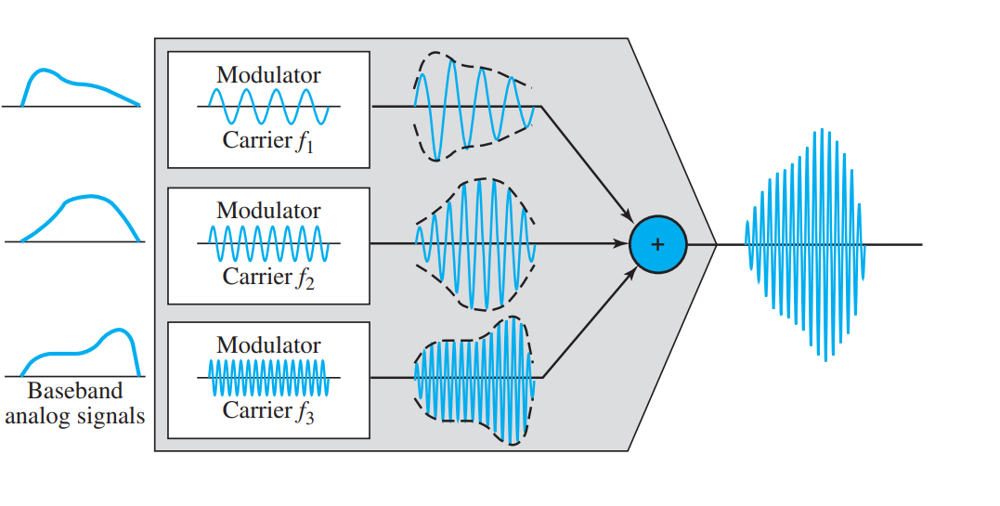

```{r knitr_init, echo=FALSE, error=FALSE, message=FALSE, warning=FALSE, cache=FALSE}
library(knitr)
library(highcharter)
library(rmdformats)
library(magrittr)
library(gsignal)
## Global options
options(max.print="75")
opts_chunk$set(echo=TRUE,
	             cache=TRUE,
               prompt=FALSE,
               tidy=TRUE,
               comment=NA,
               message=FALSE,
               warning=FALSE)
opts_knit$set(width=75)
```
# Práctica:

Multiplexar las siguientes señales:

- $\cos(10\pi t)$
- $\cos(20\pi t)$
- $\frac{4}{\pi}\sin(6\pi t) + \frac{1}{3}\sin(18\pi t)$

# Multiplexación en el dominio de la frecuencia

<p style = "text-align: justify">
La multiplexación se  <b> clasifica </b> en dos grandes tipos: multiplexación en el dominio de la frecuencia (FDM) y multiplexación en el dominio del tiempo (TDM). Primeramete nos centraremos en la: <h3> multiplexación en el dominio de la frecuencia </h3> donde esta divide el ancho de banda $B_{\omega}$, en canales $B^i_{\omega}$, de tal modo que utilizan ese espacio para transmitir durante cualquier espacio de tiempo. 
</p>



<p style = "text-align: justify">
A continuación, obtendremos paso a paso una señal multiplexada, iniciando primeramente con los bloques de modulación AM. </p>

## Modulación AM

<p style = "text-align: justify">
Recordemos que la modulación AM puede clasificarse en varios tipos, como por ejemplo, la modulación DSB, DSBSC, SSB y VSB. No ahondaremos sobre cada una de ellas, sin embargo, se puede ahondar más en libros de sistemas de comunicaciones. En cambio, utilizaremos la modulación AM-DSB (de doble banda lateral con portadora suprimida) que se define como:
</p>

$$
s(t)_{\mbox{AM-DSB}} = f(t)\times \cos(2\pi f_c t),
$$
<p style = "text-align: justify">
donde, $f(t)$ representa la señal de información y la función coseno es la portadora con frecuencia $f_c$. La frecuencia $f_C$ es la que se encarga de controlar el punto hacía donde el espectro de la señal de información $f(t)$ se trasladará. Por ejemplo si $F(\omega)$ representa el espectro de $f(t)$, entonces:</p>

$$
\mathcal{F}\left\{f(t)\cos(\omega_c t)\right\} = \frac{1}{2}\left( F(\omega+\omega_c)+F(\omega-\omega_c)\right)2,
$$
<p style="text-alilgn: justify">donde $w_c = 2\pi f_C$.

## Ejercicio 1:

Como parte de la actividades se tomara en cuenta multiplexar la siguiente señal:

$\cos(10\pi t)$


```{r AM}
t   <- seq(0,1, length=1000) #Se declara el tiempo.
ft  <- cos(10*pi*t) #Señal de información original.
ca  <- cos(2*pi*40*t) #Señal portadora.
am  <- ft*ca #Señal AM.
highchart() %>% hc_add_series(cbind(t,ft), name="Información", color = "#ffdbc4") %>% hc_title(text=" \\(f(t) = \\cos(10\\pi  t)\\)", useHTML=T) %>% hc_add_theme(hc_theme_darkunica()) %>% hc_xAxis(title=list(text="Tiempo")) %>% hc_yAxis(title = list(text="Valores", useHTML=T), min=-1.3, max = 1.3, allowDecimal = T) %>% hc_chart(zoomType="xy") %>% hc_add_series(cbind(t,am), name="AM", color = "#ac21e6") %>% hc_add_series(cbind(t,ft), type= "line", dashStyle = "Dash", name="Envelope", color = "#7cfc00") %>% hc_add_series(cbind(t,-ft), type= "line", dashStyle = "Dash", name="Envelope", color = "#7cfc00")
```
<br>
<p style="text-alilgn: justify">Nótese que la señal portadora debe ser de una frecuencia mayor que la señal de información. La demodulación AM, se puede obtener multiplicando por la misma señal portadora y posteriormente haciendo pasar la señal por un filtro pasabajas. </p>

## Demodulación AM

<p style="text-alilgn: justify">
La demodulación AM, por tando es el mismo modulador AM y posteriormente pasando el resultado por un filtro. Por tanto, despues de realizar la modulación AM por segunda ocasión, ésta queda como:</p>

```{r dAM}
t   <- seq(0,1, length=1000) 
inf  <- cos(10*pi*t) #Señal de información original.
crr  <- cos(2*pi*40*t)
am  <- inf*crr
demAM <- am*crr

highchart() %>% hc_add_series(cbind(t,demAM), name="AM-DEM", color = "#00ffff") %>% hc_add_series(cbind(t, inf), dashStyle = "Dash", name="Información",  color = "#7cfc00") %>%  hc_title(text="Modulación AM de una señal AM", useHTML=T) %>% hc_add_theme(hc_theme_darkunica()) %>% hc_xAxis(title=list(text="Tiempo")) %>% hc_yAxis(title = list(text="Valores", useHTML=T), min=-1.8, max = 1.8, allowDecimal = T) %>% hc_chart(zoomType="xy")
```
<br>
<p style="text-alilgn: justify">Nótese que la señal resultante de esta segunda multiplicación es la señal de información junto a una señal de alta frecuencia que representa la señal portadora. Por lo tanto, el siguiente paso es eliminar la componente de alta frecuencia mediante un filtro pasabaja. La frecuencia de corte de éste filtro debe ser de por lo menos $7Hz$.`R` posee un paquete llamado `gsignal` que permite diseñar filtros mediante la función `butter`, que diseña un filtro tipo Butterworth. No se ahondará en la teoría y diseño de filtros, sin embargo, se necesita un filtro de por lo menos $7$Hz para recuperar la señal de información. Por lo tanto:</p>


```{r filtr}
library(highcharter)
library(gsignal)
t   <- seq(0,1, length=1000) #Se declara el tiempo.
ft  <- cos(10*pi*t) #Señal de información original.
ca  <- cos(2*pi*40*t) #Señal portadora.
am  <- ft*ca
demAM <- am*ca
fil   <- butter(4, 0.02)
recv  <- filter(fil, demAM)
highchart() %>% hc_add_series(cbind(t,ft), name="Señal Original", color = "#8b008b") %>% hc_add_series(cbind(t, recv), name="Señal Recibida", color = "#ffb703") %>%  hc_title(text="Demodulación AM", useHTML=T) %>% hc_add_theme(hc_theme_538()) %>% hc_xAxis(title=list(text="Tiempo")) %>% hc_yAxis(title = list(text="Valores", useHTML=T), min=-1.8, max = 1.8, allowDecimal = T) %>% hc_chart(zoomType="xy")
```
## Demultiplexación FDM


En el receptor se tiene el siguiente diagrama. El cual consta de 


    
    

## Ejercicio 2:
Como parte de la actividades se tomara en cuenta multiplexar la siguiente señal:

$\cos(20\pi t)$


```{r am cos20pit}
t   <- seq(0,1, length=1000) #Se declara el tiempo.
ft  <- cos(20*pi*t) #Señal de información original.
ca  <- cos(2*pi*60*t) #Señal portadora.
am  <- ft*ca #Señal AM.

highchart() %>% hc_add_series(cbind(t,ft), name="Información", color = "#ffdbc4") %>% hc_title(text=" \\(f(t) = \\cos(20\\pi  t)\\)", useHTML=T) %>% hc_add_theme(hc_theme_darkunica()) %>% hc_xAxis(title=list(text="Tiempo")) %>% hc_yAxis(title = list(text="Valores Usados", useHTML=T), min=-1.3, max = 1.3, allowDecimal = T) %>% hc_chart(zoomType="xy") %>% hc_add_series(cbind(t,am), name="AM", color = "#ac21e6") %>% hc_add_series(cbind(t,ft), type= "line", dashStyle = "Dash", name="Envelope", color = "#7cfc00") %>% hc_add_series(cbind(t,-ft), type= "line", dashStyle = "Dash", name="Envelope", color = "#7cfc00")
```
<br>
<p style="text-alilgn: justify">Nótese que la señal portadora debe ser de una frecuencia mayor que la señal de información. La demodulación AM, se puede obtener multiplicando por la misma señal portadora y posteriormente haciendo pasar la señal por un filtro pasabajas. </p>

## Demodulación AM

<p style="text-alilgn: justify">
La demodulación AM, por tando es el mismo modulador AM y posteriormente pasando el resultado por un filtro. Por tanto, despues de realizar la modulación AM por segunda ocasión, ésta queda como:</p>

```{r dam cos20pit}
t   <- seq(0,1, length=1000) 
inf  <- cos(20*pi*t) #Señal de información original.
crr  <- cos(2*pi*60*t)
am  <- inf*crr
demAM <- am*crr

highchart() %>% hc_add_series(cbind(t,demAM), name="AM-DEM", color = "#20b2aa") %>% hc_add_series(cbind(t, inf), dashStyle = "Dash", name="Información",  color = "#7cfc00") %>%  hc_title(text="Modulación AM de una señal AM", useHTML=T) %>% hc_add_theme(hc_theme_darkunica()) %>% hc_xAxis(title=list(text="Tiempo")) %>% hc_yAxis(title = list(text="Valores", useHTML=T), min=-1.8, max = 1.8, allowDecimal = T) %>% hc_chart(zoomType="xy")
```

```{r filtr cos20pit}
library(highcharter)
library(gsignal)
t   <- seq(0,1, length=1000) #Se declara el tiempo.
ft  <- cos(20*pi*t) #Señal de información original.
ca  <- cos(2*pi*60*t) #Señal portadora.
am  <- ft*ca
demAM <- am*ca
fil   <- butter(4, 0.02)
recv  <- filter(fil, demAM)
highchart() %>% hc_add_series(cbind(t,ft), name="Original", color = "#8b008b") %>% hc_add_series(cbind(t, recv), name="Recibida", color = "#ffb703") %>%  hc_title(text="Demodulación AM", useHTML=T) %>% hc_add_theme(hc_theme_538()) %>% hc_xAxis(title=list(text="Tiempo")) %>% hc_yAxis(title = list(text="Valores", useHTML=T), min=-1.8, max = 1.8, allowDecimal = T) %>% hc_chart(zoomType="xy")

```

## Ejercicio 3:
Como parte de la actividades se tomara en cuenta multiplexar la siguiente señal:

$\frac{4}{\pi}\sin(6\pi t) + \frac{1}{3}\sin(18\pi t)$

```{r am ejercicio3}
t   <- seq(0,1, length=1000) #Se declara el tiempo.
ft  <- 4/pi*sin(6*pi*t)  + 0.3*sin(18*pi*t)#Señal de información original.
ca  <- cos(2*pi*100*t) #Señal portadora.
am  <- ft*ca #Señal AM.

highchart() %>% hc_add_series(cbind(t,ft), name="Información", color = "#ffdbc4") %>% hc_title(text="\\(f(t) = 4/\\pi\\sin(6\\pi t)+1/3\\sin(18\\pi t)", useHTML=T) %>% hc_add_theme(hc_theme_darkunica()) %>% hc_xAxis(title=list(text="Tiempo")) %>% hc_yAxis(title = list(text="Valores Usados", useHTML=T), min=-1.3, max = 1.3, allowDecimal = T) %>% hc_chart(zoomType="xy") %>% hc_add_series(cbind(t,am), name="AM", color = "#ac21e6") %>% hc_add_series(cbind(t,ft), type= "line", dashStyle = "Dash", name="Envelope", color = "#7cfc00") %>% hc_add_series(cbind(t,-ft), type= "line", dashStyle = "Dash", name="Envelope", color = "#7cfc00")
```
<br>
<p style="text-alilgn: justify">Nótese que la señal portadora debe ser de una frecuencia mayor que la señal de información. La demodulación AM, se puede obtener multiplicando por la misma señal portadora y posteriormente haciendo pasar la señal por un filtro pasabajas. </p>

## Demodulación AM

<p style="text-alilgn: justify">
La demodulación AM, por tando es el mismo modulador AM y posteriormente pasando el resultado por un filtro. Por tanto, despues de realizar la modulación AM por segunda ocasión, ésta queda como:</p>

```{r dem ejercicio 3}
t   <- seq(0,1, length=1000) 
inf  <- 4/pi*sin(6*pi*t)  + 0.3*sin(18*pi*t)#Señal de información original.
crr  <- cos(2*pi*100*t) #Señal portadora.
am  <- inf*crr
demAM <- am*crr

highchart() %>% hc_add_series(cbind(t,demAM), name="AM-DEM", color = "#00ffff") %>% hc_add_series(cbind(t, inf), dashStyle = "Dash", name="Información",  color = "#7cfc00") %>%  hc_title(text="Modulación AM de una señal AM", useHTML=T) %>% hc_add_theme(hc_theme_darkunica()) %>% hc_xAxis(title=list(text="Tiempo")) %>% hc_yAxis(title = list(text="Valores", useHTML=T), min=-1.8, max = 1.8, allowDecimal = T) %>% hc_chart(zoomType="xy")
```


```{r filtr ejercicio 3}
library(highcharter)
library(gsignal)
t   <- seq(0,1, length=1000) #Se declara el tiempo.
ft  <- 4/pi*sin(6*pi*t)  + 0.3*sin(18*pi*t)#Señal de información original.
ca  <- cos(2*pi*100*t) #Señal portadora.
am  <- ft*ca
demAM <- am*ca
fil   <- butter(4, 0.02)
recv  <- filter(fil, demAM)
highchart() %>% hc_add_series(cbind(t,ft), name="Original", color = "#8b008b") %>% hc_add_series(cbind(t, recv), name="Recibida", color = "#ffb703") %>%  hc_title(text="Demodulación AM", useHTML=T) %>% hc_add_theme(hc_theme_538()) %>% hc_xAxis(title=list(text="Tiempo")) %>% hc_yAxis(title = list(text="Valores", useHTML=T), min=-1.8, max = 1.8, allowDecimal = T) %>% hc_chart(zoomType="xy")
```

